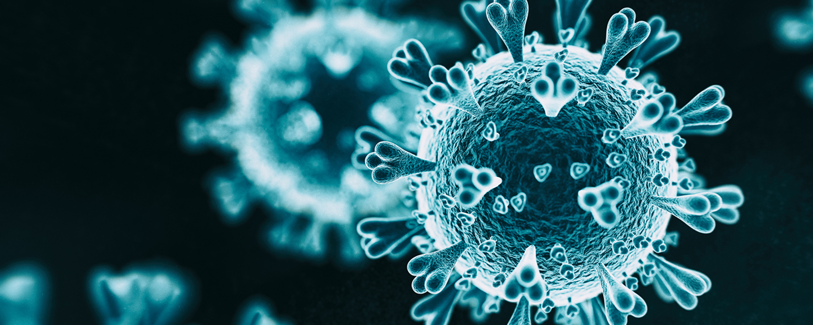

# COVID-Detection-via-CT-Scan-Image-Analysis

Big Data and Cloud Computing Mini Project 2 by Marvee dela Resma and Patrick Guillano La Rosa - March 07, 2022. The code, analysis, and the full report are included in the [Technical Report](https://github.com/pgplarosa/COVID-Detection-via-CT-Scan-Image-Analysis/blob/main/md/main.md). If you have any questions regarding this study, please send me a message via  [LinkedIn](https://www.linkedin.com/in/patricklarosa/).

## Executive Summary 

Two years after the first infection of the disease, COVID-19 remains one of the most pressing and concerning diseases that are affecting our daily lives. At present, a lot of data have already been generated and collected from the patients and medical institutions concerning the disease. This study aims to utilize both machine and big data to create insights and preliminary descriptive analysis that may help generate data-driven medical assessments.

CT-Scan images of size 250 GB were processed and filtered using open lung layers to represent a CT-scan image collection. Selected layers were then processed and masked to isolate the lung and vessel portion of the image. These masks were then used to check area ratios, comparing how prominent the detected vessels were relative to the lung area. SIFT was also performed to extract features from the images, and matching was done between members of the same classification. And finally, a simple CNN was trained using the layers as input in trying to classify as infected or healthy.

Image processing and masking showed that although it cannot be generalized, covid-positive cases tend to have a higher vessel (or lesion) to lung area ratio compared to healthy lungs. Feature detection and matching algorithms such as SIFT helped determine the features of the images and found out that there more features matched in the healthy CT-scan images. And lastly, neural networks trained to classify the selected images got a validation accuracy of 80%.

For future studies, the machine learning models could still be improved by changing their architecture design and applying data augmentation techniques to the dataset to increase the generalizability of the model. The use of more images or more representative slices could also be used to gather more information. Other methods of image segmentation could also be explored.

